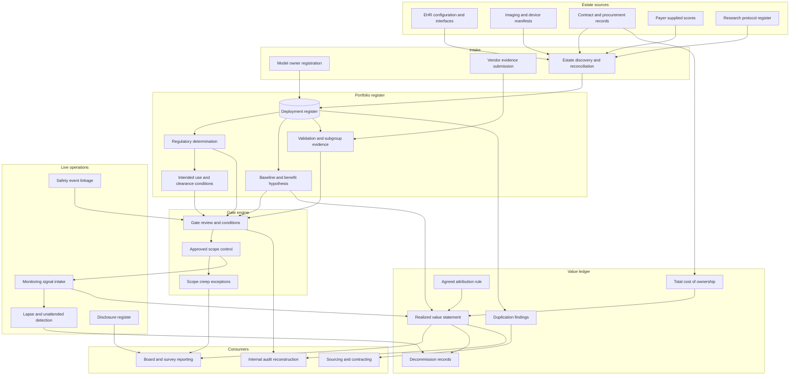

# Carecensus

**Source:** `ai-in-health/Accenture-Chart-Healthcare-Ranks-1-for-AI-Use/`
**Domain:** `ai-health`
**One-liner:** A discovery-first inventory of every algorithm already influencing care or money inside a health system — including the ones nobody declared — which forces a device classification, an intended-use check, and local validation with subgroup results before any deployment is cleared to scale, and suspends the ones running unattended.
**Wedge:** Integrated delivery networks and large academic medical centres already running 20–150 live algorithmic deployments across the electronic health record, imaging, revenue cycle, and research, where a newly appointed AI governance committee has a charter but no inventory and no instrumented data.
**Positioning:** Clearance-to-scale for clinical and administrative algorithms. This is not a benefits-realisation office view of announced initiatives, and not a model-monitoring tool watching the models the data science team already knows about: Carecensus starts from the estate rather than from the project list, reconciling the register against EHR configuration, imaging manifests, contracts, payer files, and research protocols to surface what is running. Its governing question is whether each running algorithm is classified, validated on this population, attended by a named owner, and inside its approved scope — with realised value the statement it can then defend, rather than the reason it exists.

## Market research synthesis

### Thesis from source

The source is a single ranking exhibit: industry use of artificial intelligence, with healthcare at the top at 15%, tied with mining and minerals at 15%, ahead of telecom and retail at 13%, insurance and banking at 10%, public service at 9%, manufacturing, consumer packaged goods, and IT/tech at 8%, oil and gas and chemicals at 7%, and metals last at 5%. The stated claim is narrow and worth taking literally: healthcare has the highest *rate of use* among the industries surveyed.

Two readings of that ranking matter more than the headline. First, healthcare out-adopts the technology industry itself, which the chart places at 8% — roughly half healthcare's rate. Adoption in healthcare is therefore not being pulled by technical capability or engineering density; it is being pushed by operational pain acute enough that clinical and financial leaders buy algorithms before they have the internal apparatus to govern them. Second, the winning number is 15%. Leading the field still means that roughly five in six organisations or processes are not using AI. A market at that level of penetration is characterised by breadth without depth: many small, locally sponsored deployments rather than a few enterprise programmes.

The consequence inside a single health system is a structural one, and it is where the product lives. Algorithms arrive through at least six independent doors, each with its own approver. The electronic health record vendor ships predictive modules — deterioration indices, no-show risk, sepsis alerts — that an analytics team switches on with a configuration flag. Imaging vendors embed algorithms that arrived with the scanner and are governed by the vendor's own regulatory clearance. Revenue cycle vendors run denial-prediction and coding-suggestion models under a services contract that clinical governance never reads. A research group deploys a locally trained model under a study protocol and then quietly keeps it running after the study closes. A department buys an ambient documentation tool on a departmental budget below the procurement threshold. And the payer sends risk scores that clinicians act on daily without anyone treating them as a model at all. No single office holds the list.

That fragmentation produces a specific set of losses that a governance charter alone does not stop: duplicate spend on two products doing one job in two service lines; unvalidated models influencing care because the local approval was an IT configuration change; silent performance decay after a population, coding, or workflow shift, with no owner watching; device-classified functions running outside the conditions of their clearance because the person who enabled the flag never saw the intended-use statement; and, most commercially damaging, no pre-period baseline anywhere, which makes the benefit permanently unprovable. When the chief financial officer asks what the AI portfolio returned, the honest answer is that nobody can say. When the board asks whether these tools are safe and equitable across the population, the honest answer is the same. Leading the field on adoption, in the absence of a portfolio ledger, converts an operational strength into an unpriced liability — and it is precisely the organisations at the top of this chart that carry the largest version of it.

### Buyer & economic model

- **Primary buyer:** Chief Medical Information Officer, or a Chief Health AI Officer where the role exists, co-sponsored by the Chief Financial Officer who wants the return quantified and the Chief Quality Officer who owns the safety exposure.
- **Users:** model owners, who are usually service-line clinical leaders rather than technologists; the clinical informatics and data science teams running validation; quality and patient safety; compliance, privacy, and regulatory affairs; strategic sourcing; internal audit; finance planning and analysis; and the AI governance committee itself.
- **Budget owner / value metric:** the digital and analytics investment portfolio, plus the quality and safety budget that funds validation. The primary value metric is coverage and posture — the share of running algorithms that are registered, classified, locally validated with subgroup results, and attended by a present owner inside an approved scope. The secondary metric is financial: realised benefit per deployment against its hypothesis and the cost released by retiring redundant or non-performing deployments.
- **Competing status quo:** a spreadsheet in the informatics office, an IT change-advisory board that sees integration tickets rather than clinical functions, procurement records listing vendors but not model behaviours, a research review board that sees studies but not operations, and a set of vendor dashboards each computing its own benefit on its own denominator. The emerging alternative — standing up an AI governance committee with a policy document — creates the demand for this product rather than satisfying it, because the committee's first discovery is that it has no data.

### Domain constraints

- **Regulatory / trust / safety:** every registered function needs a defensible determination of whether it is a regulated device, tested against the clinical decision support criteria — whether the output is time-critical, whether the clinician can independently review the basis for the recommendation, whether the function drives diagnosis or treatment selection. Cleared devices carry intended-use statements and clearance conditions that constrain population, workflow, and claims, and any deployment outside them is off-label use the organisation is accepting on its own account. Models that continue to learn need a predetermined change-control discipline so that a silent retrain is not an unreviewed new device. Nondiscrimination duties attaching to patient-care decision support require documented subgroup evaluation and a written risk-mitigation plan. Accreditation and conditions of participation bring the whole portfolio into scope of survey. The research-versus-operations boundary must be explicit, because a model that crossed from a study protocol into routine care changed its governing regime without changing its code.
- **Data sensitivity:** local validation is only meaningful on local patient-level data, which means the register's evidence layer touches identifiable or limited-data-set records under HIPAA and must document the secondary-use basis. Vendor participation in validation requires a business associate agreement and constrains where evaluation data may travel; a "vendor benchmark" that ships records to a startup's environment is a disclosure, not an analysis. Subgroup evaluation depends on race, ethnicity, language, and disability data that is incomplete in most systems and itself sensitive, so the register must record data completeness alongside the result rather than silently reporting a clean number computed on the half of the population that has demographics recorded.
- **Change-management realities:** model owners are practising clinicians with no protected time; a gate that costs a service line a week of paperwork will be routed around, so the register must harvest evidence from artefacts that already exist — validation notebooks, contract documents, clearance letters, monitoring exports — rather than demanding new prose. Finance and clinical operations disagree structurally about attribution, so the arbitration rule must be agreed once and applied uniformly. And declaring a deployment a failure is career-costly for its sponsor, which means retirement needs an explicit no-fault route or the portfolio will only ever grow.

## Business requirements

- BR-1: The organisation must hold one register of every algorithm that influences a clinical decision, a care pathway, a patient communication, or a payment, regardless of whether it was built internally, configured inside a vendor product, embedded in a device, or supplied by a payer; discovery of unregistered deployments must be an ongoing operational duty with a named owner, not a one-off census.
- BR-2: Every registered deployment must carry a documented regulatory determination with the reasoning that led to it, and where it is a cleared device, the intended-use conditions must be recorded and any deployment outside them must be an explicit, approved, signed acceptance of off-label use.
- BR-3: No deployment may expand beyond its approved scope — additional sites, service lines, populations, or workflows — without passing a gate review, and expansion without a gate must be detectable and reversible.
- BR-4: A deployment may not claim benefit unless a pre-period baseline for its stated measure was recorded before it went live; where no baseline exists, the deployment must be reported as unmeasurable rather than as successful.
- BR-5: Local validation must report performance for demographic subgroups alongside overall performance, must state the completeness of the demographic data it used, and a material subgroup gap must block scaling until a documented mitigation is approved.
- BR-6: Every live deployment must have a named accountable owner and a monitoring commitment with a defined review cadence; a deployment whose owner leaves the organisation or whose monitoring lapses must be automatically flagged for suspension rather than continuing unattended.
- BR-7: Clinicians acting on a model's output must be able to see, at the point of use, what the model is, what it was validated on, and its known limitations; patients must be informed where required by policy or law, and both disclosures must be evidenced in the register.
- BR-8: Realised value must be reconciled with finance on an agreed attribution rule and reported net of the total cost of ownership, including licence, integration, validation, monitoring, and clinician time; the register must publish negative and null results with the same prominence as positive ones.
- BR-9: The register must detect functional duplication across the enterprise — two deployments serving the same job in different service lines — and require an explicit consolidation or coexistence decision with a named decision-maker.
- BR-10: Retirement must be a supported, no-fault outcome with a defined decommissioning record covering clinician notification, workflow reversion, data disposition, and contract termination, so that stopping a deployment is as governed as starting one.
- BR-11: Any patient-safety event or complaint plausibly connected to a deployment must be linkable to it in the register, and the linked event history must be visible in every subsequent gate review of that deployment.
- BR-12: The register must produce, on demand and without a special project, a portfolio statement suitable for the board, an accreditation survey, or a regulator, showing every live deployment, its classification, its validation status, its monitoring state, and its measured effect.

## User stories

Canonical user stories live in sibling [USER_STORIES.md](USER_STORIES.md).

## System design

### Overview

Carecensus is a register with gates and a benefit ledger attached. Deployments enter through registration or through discovery — reconciliation against contract records, interface logs, imaging vendor manifests, EHR configuration exports, and payer file inventories — so that the portfolio reflects what is running rather than what was declared. Each registered deployment carries a version history, a regulatory determination, an intended-use record, validation studies with subgroup results, a benefit hypothesis, and a baseline captured before go-live. Movement between lifecycle stages is only possible through a gate review whose evidence requirements are defined by the deployment's classification and clinical reach, so a revenue-cycle denial model and an imaging triage device face proportionate scrutiny rather than the same checklist. Once live, monitoring signals, linked safety events, subgroup results, and financial actuals accumulate against the deployment, and the value-realisation engine converts them into a statement reconciled with finance on a pre-agreed attribution rule. Retirement is a first-class terminal stage with its own record.

### Actors & boundaries

- **Actors:** model owners, validation analysts, quality and safety, compliance and regulatory affairs, privacy, sourcing, finance, internal audit, the governance committee, vendors as constrained participants, and the platform administrator.
- **Trust boundary:** the gate is the boundary. Model owners may propose and evidence but not approve their own advancement; the committee may approve but not edit evidence; monitoring signals and finance actuals are received from systems of record rather than typed in by the sponsor. Vendors may submit evidence and clearance documents into a scoped submission surface but cannot read the portfolio, and no patient-level validation data crosses to a vendor without a recorded agreement basis.
- **Human-in-the-loop points:** the regulatory determination and its reasoning; gate approval and any conditions attached; acceptance of off-label deployment; approval of a subgroup mitigation plan; agreement of the attribution rule; the consolidation-or-coexistence decision on duplication; and sign-off of each realised-value statement by both the model owner and finance.

### Core capabilities

1. **Portfolio register** — one record per deployment with versions, owners, scope, clinical reach, and provenance, whether internal, vendor-embedded, device-resident, or payer-supplied.
2. **Discovery and reconciliation** — continuous comparison of the register against contracts, interfaces, configuration exports, and vendor manifests to surface unregistered deployments.
3. **Regulatory classification** — device determination with recorded reasoning, intended-use capture, clearance conditions, off-label acceptance, and change-control status for learning models.
4. **Validation evidence** — local and vendor studies, population match, performance by subgroup with data-completeness disclosure, and mitigation plans.
5. **Gate engine** — lifecycle stages with evidence requirements scaled to classification and reach, conditions, approvals, and detection of advancement without a gate.
6. **Baseline and benefit hypothesis** — pre-period measurement capture with a hard block on benefit claims where no baseline exists.
7. **Monitoring intake** — drift, calibration, utilisation, and override signals bound to deployment versions, with lapse detection and unattended-deployment flags.
8. **Safety linkage** — association of patient-safety events and complaints to deployments, visible in all later gate reviews.
9. **Value realisation** — realised benefit against hypothesis, net of total cost of ownership, reconciled with finance under an agreed attribution rule, publishing null and negative results.
10. **Duplication and consolidation** — functional overlap detection across service lines with spend attached and a required decision.
11. **Disclosure register** — evidence of clinician-facing and patient-facing disclosure where policy or law requires it.
12. **Decommissioning** — retirement records covering notification, workflow reversion, data disposition, and contract termination.
13. **Portfolio reporting and audit reconstruction** — board, survey, and regulator views, plus point-in-time reconstruction of gates, evidence, and thresholds.

### Conceptual data

- **Primary entities:** Deployment, DeploymentVersion, RegulatoryDetermination, IntendedUseRecord, ValidationStudy, SubgroupResult, BenefitHypothesis, BaselineMeasurement, GateReview, GateDecision, DeploymentScope, MonitoringSignal, SafetyEventLink, RealizedValueStatement, TotalCostOfOwnership, DuplicationFinding, DisclosureRecord, DecommissionRecord, VendorRecord, AttributionRule, PortfolioStatement.
- **Critical events:** deployment registered, unregistered deployment discovered, determination recorded, baseline captured, gate submitted, gate decided with conditions, deployment went live, scope expanded, monitoring signal raised, monitoring lapsed, owner departed, safety event linked, subgroup gap detected, mitigation approved, value statement reconciled and signed, duplication decided, deployment retired.
- **Retention / audit needs:** determinations, gate decisions, evidence, and the thresholds in force must be retained with immutable version history for the device-record and product-liability horizon, because the reconstructable question is what the organisation knew and approved on a given date. Validation datasets are retained by reference and access basis rather than copied into the register. Monitoring signals retained long enough to establish trend and to support post-market reporting. Realised-value statements retained with their attribution rule attached, since a benefit number without its rule is not auditable.

### Integrations (conceptual)

- **Systems of record:** the electronic health record and its configuration and interface inventory, the imaging and picture archiving estate with its device manifests, revenue cycle platforms, the contract lifecycle and procurement system, the patient-safety event reporting system, the research review board's protocol register, and the general ledger.
- **Upstream signals:** model monitoring and observability outputs, EHR audit and utilisation logs showing whether a recommendation was seen and acted on, override and alert-response telemetry, human resources data for owner departures, vendor regulatory clearance documents and change notices, payer model documentation, and demographic data completeness statistics.
- **Downstream actions:** gate task assignment to owners and reviewers, suspension notices for unattended or out-of-scope deployments, disclosure content published into the clinician workflow, consolidation decisions routed to sourcing, decommissioning workflows into IT and contracting, portfolio statements into board and survey packs, and post-market safety reports where a device classification requires them.

### High-level architecture

Two intakes feed one register: what people declare, and what the estate reveals. Gates sit between lifecycle stages so that scale is earned; the value ledger sits downstream of both monitoring and finance so that the benefit number cannot be produced by the sponsor alone.

### Success metrics

- **Leading:** share of live deployments in the register versus discovered-but-unregistered count; share carrying a completed regulatory determination; share with a baseline captured before go-live; share with subgroup results and stated demographic completeness; median elapsed time from gate submission to decision; proportion of live deployments with an in-date monitoring commitment and a present owner; count of scope-creep exceptions detected by the system rather than reported by a human.
- **Lagging:** realised benefit against hypothesis across the portfolio, reported with null and negative results included; cost released from retirements and consolidations; share of the portfolio that is unmeasurable for lack of a baseline, trending down; number of safety events linked to deployments and time from linkage to a governance decision; audit and survey findings related to algorithmic governance; portfolio concentration in any single vendor.

## OpenAPI skeleton

Canonical HTTP surface lives in sibling [openapi.yaml](openapi.yaml). Summary:

- **Base path:** `/v1/...`
- **Auth:** `X-API-Key` for estate discovery feeds, monitoring exports, and finance actuals; Bearer JWT for console users, with gate approval, off-label acceptance, and suspension restricted by role.
- **Resource groups:** Register, Discovery, Classification, Validation, Gates, Monitoring, Value Realization, Portfolio Governance.
