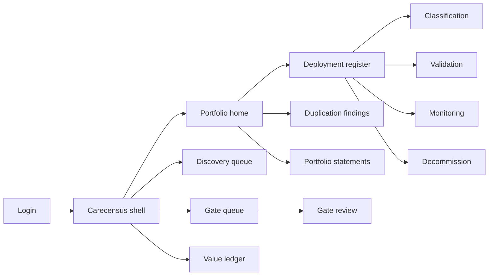
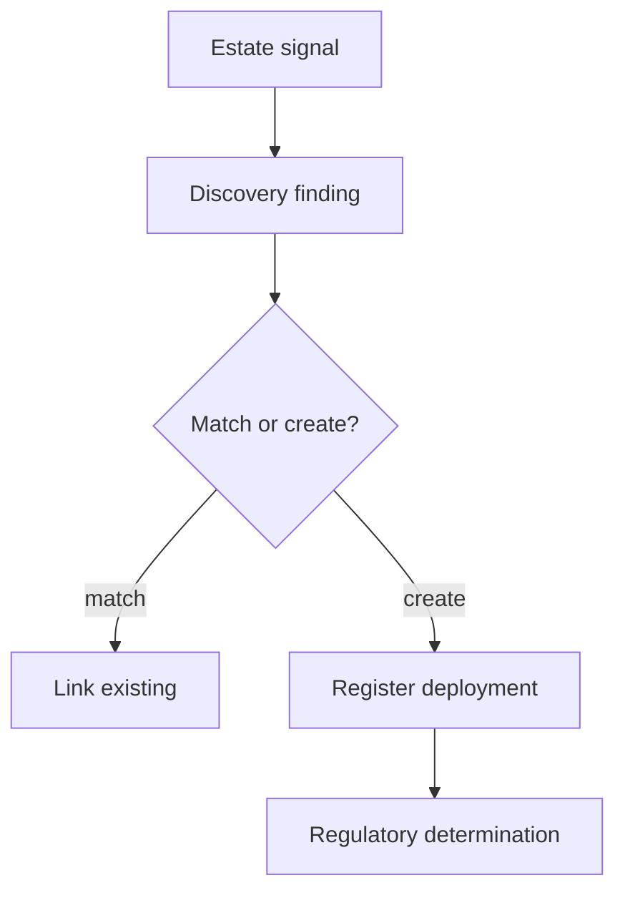

# Carecensus — Web app

**Product:** [PRODUCT.md](./PRODUCT.md)
**Primary surface:** Algorithm portfolio register and gate console (AI governance shell)
**Secondary surfaces:** Vendor evidence submission portal (scoped, write-only evidence); board/survey portfolio statement export (read-only)
**Design thesis:** Carecensus is a clearance ledger for algorithms already running — a census of influence, not a data-science MLOps cockpit and not a benefits PowerPoint. The metaphor is a medical-device inventory crossed with a change-advisory board: every row is a deployment that can touch care or money, discovered from the estate when sponsors forget to declare it. Visual language is archival ink and gate-amber on cool limestone panels — “unmeasurable” is a first-class status colour equal to success; unattended deployments feel quarantined. The Carecensus wordmark anchors every portfolio statement so the board sees coverage posture before any vendor’s claimed ROI.

## UX research synthesis

### Category peers (best-in-class)

- **Holistic AI / Credo AI (AI governance platforms):** Model inventory, risk tiers, evidence packs for committees. Steal: deployment-centric register with proportional gates; reject generic “AI risk score” that hides device determination and intended use.
- **Veeva Vault QualityDocs / MasterControl (regulated evidence):** Controlled documents, e-signatures, reconstructable state. Steal: immutable gate decisions and point-in-time reconstruction; reject pharma batch-record chrome for EHR-config algorithms.
- **ServiceNow GRC / Change Management:** Exception queues, owner lapse, CAB-style approvals. Steal: discovery findings as work items with reconciliation; reject ITIL ticket aesthetics as the only clinical metaphor.
- **Epic Healthy Planet / Clarity registry patterns (health-system registers):** Named owners, completeness disclosure, survey-ready extracts. Steal: demographic completeness beside subgroup results; reject population-health dashboard as home for algorithm governance.

### Patterns to adopt / reject

- **Adopt:** Discovery-first intake; regulatory determination with reasoning; baseline-or-unmeasurable rule; owner/monitoring lapse → suspend; no-fault retirement; null/negative value with equal prominence; duplication decisions with spend attached.
- **Reject:** Project-list-only views; vendor self-attested benefit as portfolio truth; purple “AI maturity” radar charts; one checklist for sepsis alerts and denial models; editable realised-value fields after finance reconciliation.

### Trust, density, and workflow constraints from PRODUCT.md

The register must reflect what is running, not what was announced (BR-1). Device determination and off-label acceptance are signed organisational decisions (BR-2). Scope expansion without a gate must be visible and reversible (BR-3). No baseline means unmeasurable, never success (BR-4). Subgroup gaps block scale (BR-5). Unattended = suspend (BR-6). Disclosures must be evidenced (BR-7). Value is net of TCO under a locked attribution rule (BR-8). Model owners have no protected time — harvest artefacts, don’t demand essays.

## Information architecture

### Nav model

### Roles → default home

| Role | Default home | Why |
|------|--------------|-----|
| CMIO / Chief Health AI Officer | Portfolio home — coverage posture | Estate-level clearance (BR-1, BR-12) |
| Model owner (service-line leader) | My deployments + next gate evidence | Hour-not-week registration |
| Validation / clinical informatics | Validation queue + unvalidated vendors | Subgroup + completeness (BR-5) |
| Regulatory / compliance | Classification + off-label acceptances | Device determination (BR-2) |
| Governance chair | Gate queue + scope exceptions | Clearance-to-scale (BR-3) |
| Finance BP / CFO | Value ledger + duplication spend | Net TCO (BR-8, BR-9) |
| Internal auditor | Portfolio statements as-of | Reconstruction (BR-12) |

### Cross-links to OpenAPI resources

| Nav area | OpenAPI tags / resources |
|----------|---------------------------|
| Deployment register, versions, vendors | Register |
| Unregistered findings, reconciliation | Discovery |
| Regulatory determination, intended use, off-label | Classification |
| Validation studies, subgroup mitigations | Validation |
| Gate reviews, decisions, scope, suspension | Gates |
| Monitoring signals, lapses, safety links | Monitoring |
| Attribution rules, value statements | Value Realization |
| Duplication, disclosures, decommission, portfolio statements | Portfolio Governance |

## Screen inventory

### Portfolio home

- **Purpose:** Answer “what share of running algorithms is registered, classified, validated, and attended?” in one composition.
- **Entry:** Default for CMIO / governance leadership.
- **Layout regions:** Brand + org context; coverage posture strip (registered vs discovered, classified, validated with subgroups, attended); exception rail (unattended, out-of-scope, off-label unsigned); recent gate outcomes.
- **Primary actions:** Open discovery; open gate queue; generate portfolio statement.
- **Empty / loading / error:** Empty estate = guided first discovery run; loading = skeleton posture; error = feed reconciliation failure with request id.
- **BR / story ties:** BR-1, BR-6, BR-12.

### Deployment register

- **Purpose:** One record per algorithm influencing care, pathway, communication, or payment.
- **Entry:** Portfolio nav; search from home.
- **Layout regions:** Filterable table (lifecycle, provenance, unmeasurable flag, owner present); row opens dossier; provenance badges (EHR config, imaging device, RCM vendor, research, payer, departmental buy).
- **Primary actions:** Register new; open dossier; filter unmeasurable; export register slice.
- **Empty / loading / error:** Empty = “run discovery — declared list is not the estate.”
- **BR / story ties:** BR-1; model owner registration story.

### Discovery queue

- **Purpose:** Ongoing duty to surface unregistered deployments from estate signals.
- **Entry:** Discovery nav; home exceptions.
- **Layout regions:** Findings list (source system, suspected function, confidence); reconcile pane (match existing / create deployment / dismiss with reason); named discovery owner.
- **Primary actions:** Reconcile; assign owner; escalate chronic unreconciled.
- **Empty / loading / error:** Empty = last successful reconciliation timestamp (healthy); stale feed = amber duty banner.
- **BR / story ties:** BR-1.

### Deployment dossier

- **Purpose:** Single place for version history, scope, owner, and gate status.
- **Entry:** Register row; gate deep link.
- **Layout regions:** Header (name, lifecycle, owner, monitoring cadence); tabs: Classification, Validation, Baseline/Hypothesis, Monitoring, Safety, Value, Disclosures, Decommission; evidence harvest tray (attach existing artefacts).
- **Primary actions:** Submit to gate; request suspension; start no-fault retirement.
- **Empty / loading / error:** Missing owner = auto suspension candidate banner (BR-6).
- **BR / story ties:** BR-1–BR-7, BR-10, BR-11.

### Classification

- **Purpose:** Record device determination with reasoning and intended-use conditions.
- **Entry:** Dossier → Classification.
- **Layout regions:** Determination form with CDS criteria prompts; clearance conditions; off-label acceptance with signer; learning-model change-control status.
- **Primary actions:** Save determination; sign off-label acceptance; attach clearance letter.
- **Empty / loading / error:** No determination = blocked from scale gates.
- **BR / story ties:** BR-2; regulatory officer stories.

### Validation and subgroups

- **Purpose:** Local validation with subgroup results and demographic completeness disclosed.
- **Entry:** Dossier → Validation; informatics queue.
- **Layout regions:** Study list; overall vs subgroup table; completeness %; mitigation plan status; vendor-never-validated filter.
- **Primary actions:** Attach study; propose mitigation; block-scale indicator when gap material.
- **Empty / loading / error:** Incomplete demographics = caveated result, not silent clean number.
- **BR / story ties:** BR-5.

### Baseline and benefit hypothesis

- **Purpose:** Capture pre-period baseline before go-live; lock benefit claims otherwise.
- **Entry:** Dossier before go-live gate.
- **Layout regions:** Hypothesis fields; baseline period; hard “unmeasurable” preview if launching without baseline.
- **Primary actions:** Record baseline; acknowledge unmeasurable path; attach measure definition.
- **Empty / loading / error:** Attempted benefit claim without baseline = blocked with explanation (BR-4).
- **BR / story ties:** BR-4; model owner baseline story.

### Gate review

- **Purpose:** Proportionate clearance by classification and clinical reach.
- **Entry:** Gate queue; dossier submit.
- **Layout regions:** Evidence checklist (what’s on file vs required); conditions editor; safety-event history panel; decision + e-sign; scope snapshot.
- **Primary actions:** Approve with conditions; defer; reject; detect/revert ungated expansion.
- **Empty / loading / error:** Incomplete evidence = non-submittable with exact gaps.
- **BR / story ties:** BR-3, BR-11; governance chair stories.

### Monitoring and attendance

- **Purpose:** Bind drift/utilisation/override signals to versions; flag lapses and departed owners.
- **Entry:** Dossier → Monitoring; portfolio exceptions.
- **Layout regions:** Signal timeline; cadence commitment; lapse list; suspend control.
- **Primary actions:** Acknowledge signal; suspend unattended; reassign owner.
- **Empty / loading / error:** No signals ≠ healthy if monitoring feed offline — show feed status.
- **BR / story ties:** BR-6.

### Value ledger

- **Purpose:** Realised benefit vs hypothesis, net of TCO, under locked attribution rule; null/negative equal prominence.
- **Entry:** Finance default; dossier → Value.
- **Layout regions:** Attribution rule (read-only once agreed); statement table with outcome including null/negative; TCO breakdown; dual sign-off (owner + finance).
- **Primary actions:** Reconcile statement; export; compare duplicates’ spend.
- **Empty / loading / error:** Unmeasurable deployments listed but cannot show positive benefit.
- **BR / story ties:** BR-4, BR-8.

### Duplication findings

- **Purpose:** Same clinical/admin job across service lines with spend attached.
- **Entry:** Portfolio → Duplication.
- **Layout regions:** Overlap pairs/groups; spend; required consolidate-or-coexist decision with named decision-maker.
- **Primary actions:** Decide coexistence; route consolidation to sourcing; link decommission.
- **Empty / loading / error:** Empty = no open overlaps.
- **BR / story ties:** BR-9, BR-10.

### Portfolio statement

- **Purpose:** On-demand board/survey/regulator view without a special project.
- **Entry:** Statements nav; as-of picker.
- **Layout regions:** Live deployments; classification; validation; monitoring; measured effect; unmeasurable callouts; reconstructable gate trail export.
- **Primary actions:** Generate as-of; export PDF/CSV; open audit reconstruction.
- **Empty / loading / error:** Generation failure preserves last good statement with timestamp.
- **BR / story ties:** BR-12.

### Decommission

- **Purpose:** No-fault retirement with notification, workflow reversion, data disposition, contract termination.
- **Entry:** Dossier terminal action.
- **Layout regions:** Checklist record; clinician notification status; IT/contract tasks; final gate visibility of history.
- **Primary actions:** Complete retirement; archive dossier as retired (still searchable).
- **Empty / loading / error:** Partial decommission = blocked “retired” status until checklist complete.
- **BR / story ties:** BR-10.

## Key flows

1. **Discover → register → classify** — estate finding → reconcile → create deployment → regulatory determination; failure: dismissed finding requires reason and remains auditable.

2. **Clearance-to-scale gate** — evidence harvest → baseline check → subgroup review → committee decision with conditions → live; failure: no baseline → may go live as unmeasurable only; subgroup gap → block scale until mitigation.

3. **Unattended suspend** — owner departure or monitoring lapse → auto flag → suspend → reroute exception to governance.

4. **Value reconcile** — lock attribution rule → compute net TCO statement → publish null/negative equally → owner + finance sign-off.

5. **No-fault retire** — sponsor initiates → decommission checklist → notify clinicians → revert workflow → close contract → terminal record.

## Design system

### Tokens (CSS variables)

- `--color-ink: #1C1F24` — primary text
- `--color-limestone: #E9E6DF` — app ground (cool stone, not warm cream brand cliché)
- `--color-panel: #F7F6F3` — panels
- `--color-archive: #5C6670` — secondary labels
- `--color-gate-amber: #B86E00` — pending gate / provisional scope
- `--color-clear-teal: #1F6F6A` — cleared / attended confirmation
- `--color-quarantine: #A33B32` — unattended / suspended / off-label unsigned
- `--color-unmeasurable: #6B5B8C` — unmeasurable benefit status (distinct, not “failure red”)
- `--color-brand: #243447` — Carecensus wordmark (slate archive)
- `--font-display: "Newsreader", serif` — portfolio posture numerals and statement titles
- `--font-body: "IBM Plex Sans", sans-serif`
- `--font-mono: "IBM Plex Mono", monospace` — deployment ids, clearance numbers, as-of stamps
- `--space-1`…`--space-8`: 4px scale
- `--radius-sm: 3px`; `--radius-md: 6px` — registry-sharp
- `--motion-gate: 180ms ease-out` — gate decision stamp
- `--motion-discover: 240ms ease-in-out` — new finding highlight
- `--motion-suspend: 160ms ease-out` — quarantine banner
- Atmosphere: subtle paper-fiber noise on limestone; stamped “as-of” watermark on portfolio statements; no neon AI orbs.

### Typography & brand

- Display for coverage posture and board statement headers; body for dossiers; mono for regulatory ids.
- Brand left of shell on register and statement views; never let “AI Portfolio Dashboard” replace the wordmark as the strongest mark.
- Login: brand-first; headline (“What is already running?”); one CTA to portfolio or discovery.

### Do / don’t

- **Do:** Treat discovery as continuous work; show unmeasurable beside wins; harvest artefacts; make suspension loud; equalize null/negative value.
- **Don’t:** Purple maturity radars; vendor ROI tiles as home KPIs; one-size gate checklist; hide retired deployments; card walls of static counts.

### Accessibility & domain trust cues

- AA+ contrast; unmeasurable uses pattern + text, not hue alone.
- Live regions for new discovery findings and suspension events.
- Focus order in gates: evidence gaps → decision → conditions.
- Vendor portal never exposes peer portfolio rows.

## Component patterns

- **DeploymentRegisterRow** — lifecycle, provenance, owner-present, unmeasurable flag.
- **DiscoveryFindingCard** — estate source + reconcile actions (interaction container).
- **GateEvidenceChecklist** — required vs on-file with proportional tier.
- **UnmeasurableBadge** — blocks positive benefit claims.
- **AttendanceMeter** — owner + monitoring cadence health.
- **OffLabelAcceptance** — signed acceptance with clearance conditions summary.
- **ValueOutcomeRow** — positive / null / negative with equal visual weight.
- **PortfolioAsOfExport** — board/survey packet generator.

## Out of scope for v1 web

- Training/hosting models; real-time clinical alert UI inside the EHR; patient-facing education apps; full contract CLM replacement; vendor marketing microsites; multi-health-system cross-tenant benchmarking that ships PHI; MLOps feature stores.
